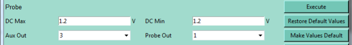
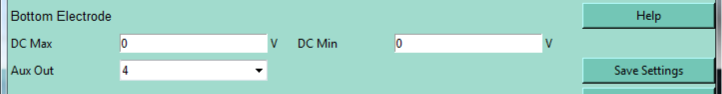
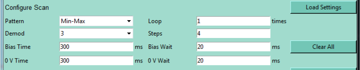
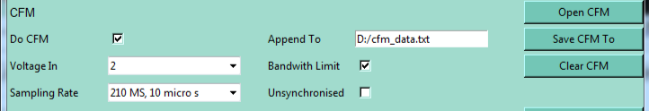
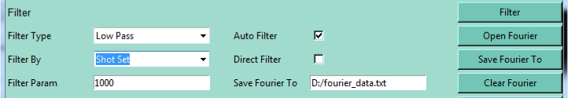
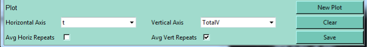
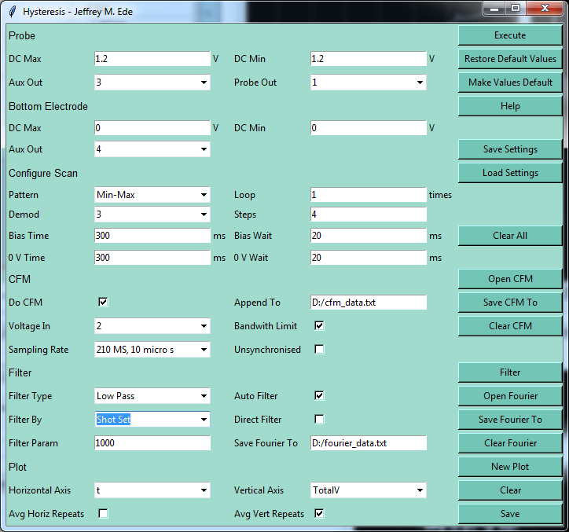

# Controls

You might be looking at the Hysteresis user interface and be thinking "How will I ever manage all these controls?" Well, don't worry: every tick box, dropdown menu and entry field has a tooltip helpfully explaining what it does. The tooltip class source code has even been uploaded to [GitHub](https://github.com/Jeffrey-Ede/Atomic-Force-Microscopy/tree/master/Hysteresis_Measurement "Hysteresis repository containing tooltip source code") so that everyone can enjoy adding these to their user interfaces. If the tooltips aren't enough, this page offers further explanation.

Here the user interface will be presented in its smaller sections. This will make locating which control is being described easier, making its explanation more succinct. The sections are:

* Probe
* Bottom Electrode
* Configure Scan
* <acronym title="Current Force Microscopy">CFM</acronym>
* Filter
* Plot
* Buttons

## Probe 

This section controls the bias applied by the <acronym title="Atomic Force Microscope">AFM</acronym> probe head. Note that the probe head is not an infinite flat plate: applied fields may be locally higher or lower than average depending on its geometry. 

Probe biases are in the opposite direction to those applied by the bottom electrode: if the probe and bottom electrode biases are both 1.2V, the sample will have a potential difference of 2.4V across it.

### DC Max

The maximum bias offset that will be applied by the probe head. This is limited to the output voltage range of the <acronym title="Lock-in Amplifier">LIA</acronym>'s auxiliary outputs: ±10V. A higher bias range can be achieved by adjusting external circuitry: for instance, by adding amplifiers or T junctions.

### DC Min

The minimum bias offset that will be applied by the probe head. This is limited to the output voltage range of the <acronym title="Lock-in Amplifier">LIA</acronym>'s auxiliary outputs: ±10V. A higher bias range can be achieved by adjusting external circuitry: for instance, by adding amplifiers or T junctions.

### Aux Out

Auxiliary output supplying the offset bias to be added to the signal outputted to the probe.

### Probe Out

Signal output going to probe. The bias offset is added to the oscillating outout signal here.

## Bottom Electrode

This section controls the bias appled to the AFM bottom electrode. Unlike the probe head, the bottom electrode has rather uniform geometry so applied fields will be affinely uniform.

Bottom electrode biases are in the opposite direction to those applied by the probe: if the probe and bottom electrode biases are 1.3V and \\(-\\)0.7V, the sample will have a potential difference of 0.6V across it.

### DC Max

The maximum bias offset that will be applied by the bottom electrode. This is limited by the output voltage range of the lock-in amplifiers auxiliary outputs to ±10V. A higher bias range can be achieved by adjusting external circuitry: for instance, by adding amplifiers or T junctions.

### DC Min

The minimum bias offset that will be applied by the bottom electrode. This is limited by the output voltage range of the lock-in amplifiers auxiliary outputs to ±10V. A higher bias range can be achieved by adjusting external circuitry: for instance, by adding amplifiers or T junctions. 

### Aux Out

Auxiliary output biasing the bottom electrode.

## Configure Scan

This section onfigures the voltages to applied and their durations. An interactive voltage train simulator is available via the FLAG tab that can be used to learn the scan parameters.

### Patterns

There are 3 patterns that voltages can be applied in min-max, min-max-min and 0-max-0-min-0. They are exactly what you think: voltage incriments follow these patterns by partitioning voltage steps appropriately. Maximum and a minimum voltage values will not be over or undershot: the size of voltage steps will be dynamically changed to fit the pattern.

### Loop

You can apply a bias incrementation pattern more than once!

### Demod

Demodulator to poll data from. 

### Steps

The number of steps in a voltage incrementation pattern. The minimum numbers are

* Min-Max: 1
* Min-Max-Min: 2
* 0-Max-0-Min-0: 4

A 0th step is added, which is not included in the total step count, as it is thought this leads to the most intuitive behaviour.

### Bias Time

Time for which measurements will be taken while a bias is applied. If <acronym title="Current Force Microscopy">CFM</acronym> mode is enabled this has to be more than ~220ms to give the scope time to set up before each measurement. If this is 0ms this bias will be skipped: the instrument won't go to that bias voltage, wait there for 0ms, then move on to the next voltage; it will be skipped completely.

### Bias Wait

A time delay where the next bias is applied but no measurements are taken. It used to give the system or voltage time to settle. If this is 0ms this bias will be skipped: the instrument won't go to that bias voltage, wait there for 0ms, then move on to the next voltage; it will be skipped completely.

### 0V Time

Time for which measurements will be taken at 0V. If <acronym title="Current Force Microscopy">CFM</acronym> mode is enabled this has to be more than ~220ms to give the scope time to set up before each measurement. If this is 0ms this bias will be skipped: the instrument won't go to that bias voltage, wait there for 0ms, then move on to the next voltage; it will be skipped completely.

### 0V Wait

A time delay where the bias is 0V but no measurements are taken. It used to give the system or voltage time to settle. If this is 0ms this bias will be skipped: the instrument won't go to that bias voltage, wait there for 0ms, then move on to the next voltage; it will be skipped completely.

## CFM

### Do CFM

Check this button to turn <acronym title="Current Force Microscopy">CFM</acronym> mode on. If <acronym title="Current Force Microscopy">CFM</acronym> mode is enabled, a scope will be polled for voltages. 

### Append To

Polled <acronym title="Current Force Microscopy">CFM</acronym> data and metadata will be appended to this file. Leave this blank to not record data.

### Voltage In

Input for <acronym title="Current Force Microscopy">CFM</acronym> voltages. These are used as a current proxy.

### Bandwidth Limit

Limit bandwidth to prevent antialiasing.

### Sampling Rate

Frequency scope is sampled. Note that sets of 2048 must be sampled: if a low sampling rate is being used, this can add a non-negligible increase to the scope time.

### Unsynchronised

If this box is ticked the scope will only be synchronised when it is booted; not before each poll. This can deacrease step times by about 140ms: each resynchronisation takes ~70ms and the the <acronym title="Lock-In Amplifier">LIA</acronym> is normally resychronised before both Bias Time and 0V Time polls. 

Note that operating in unsynchronised modes disables synchronisation for both <acronym title="Piezoelectric Force Microscopy">PFM</acronym> and <acronym title="Current Force Microscopy">CFM</acronym> measurements: it is not possible to resynchronise the <acronym title="Lock-In Amplifier">LIA</acronym> scopes and demodulators separately.

## Filter

Configure filter settings.

### Filter Type

The filter or filter or filters to use. Filters to be applied seperately are delimited by semicolons. For example, $$\mathrm{Low\; Pass;High\; Pass}$$ will apply a low pass filter and output the filtered data, then apply a high pass filter and output the filtered data in that order; left-to-right.

To apply mutltiple filters at once, separate them with colons. For example, $$\mathrm{Low\; Pass:High\; Pass}$$ will apply a low pass filter, then apply a high pass filter in that order; left-to-right, then output the filtered data.

A combination of semicolons and colons can be used simultaneously to apply multiple filters where some of the filters consist of multiple sub-filters. For example, $$\mathrm{High\; Pass;Low\; Pass:High\; Pass; Low\; Pass}$$ will be interpreted, working left-to-right for each item, as follows:

1. High Pass filter;
    * Apply high pass filter
    * Append results to filter output file
2. Low Pass:High Pass;
    * Apply Low Pass filter
    * Apply High Pass filter
    * Append results to filter output file
3. Low Pass
    * Apply Low Pass filter
    * Append results to filter output file

### Auto Filter

Clculate and output filtered signal to filter file as soon as measurements have been made.

### Filter by

Modes to apply each filter by. Each filter mode is separated by a semicolon and each filter must have at least one filter mode if it is to be applied. A filter can have more than one filter mode, separated by colons. If a filter had multiple modes it will be applied for each mode. 

### Direct Filter

Replaces raw CFM data with filtered data. If multiple filters are selected the filters will be applied in succession; from left to right.

### Filter Param

Filtering parameters for each filter are separated by semicolons. If a filter has multiple parameters, separate them with colons. Separate the parameters of filters' subfilters with circumflexes.

### Save Filter To

Location to append filter data and metadata to. Leave this blank to not record data.

## Plot

Select data to graph and control how it is plotted.

### Horizontal Axis

Data to plot on the horizontal axis of the graph.

### Vertical Axis

Data to plot on the vertical axis of the graph.

### Avg Horiz Repeats

Repeating horizontal values are averaged over.

### Avg Vert Repeats

Repeating vertical values are averaged over

## Buttons

They make stuff happen! 

### Execute

Applies voltage train, periodically polling a demodulator. The scope is also polled in <acronym title="Current Force Microscopy">CFM</acronym> mode. A graph will pop up, updating after each poll.

### Restore Default Values

Return entry field values to their default values.

### Make Values Default

Make current entry field values the default values.

### Help

Opens these web pages in the user's default web browser.

### Save Settings

Opens a saveas dialog for the user to specify a location to save the current entry field values.

### Load Settings

Opens an open dialogue for the user to specify a location to load new entry field values from.

### Clear All

Clear all data in the CFM and Filter Append to location and clear the graph data.

### Open CFM

Opens <acronym title="Current Force Microscopy">CFM</acronym> Append To file using the user's default text editor.

### Save CFM To

Opens a saveas dialog for the user to specify a location to append <acronym title="Current Force Microscopy">CFM</acronym> data to.

### Clear CFM

Clear all data in the <acronym title="Current Force Microscopy">CFM</acronym> Append To location.

### Filter

Apply filter to the data in the <acronym title="Current Force Microscopy">CFM</acronym> Append To location. Filterered data will be appended to the filter Append To location.

### Open Filter

Opens filter Append To file using the user's default text editor.

### Save Filter To

Opens a saveas dialog for the user to specify a location to append filter data to.

### Clear Filter

Clear all data in the filter Append To location.

### New Plot

Plots demodulated data specified by the Horizontal Axis and Vert Axis comboboxes. If Avg Horiz Repeats or Avg Vert Repeats are checked, the plotted data will be averaged.

### Clear

Clear demodulated data used for plotting.

### Save

Save demodulated data.

