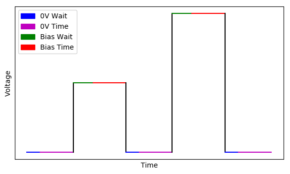

# Voltage Trains

An interactive voltage trains explanation can be found [here](https://jeffrey-ede.shinyapps.io/voltage_trains/ "Interactive voltage trains explanation"). A brief overview is also given here.

There are 4 times used to describe voltage trains:

1. 0V Wait: A time delay where the bias is 0V but no measurements are taken. It used to give the system or voltage time to settle.

2. 0V Time: Time for which measurements will be taken at 0V.

3. Bias Wait: A time delay where the next bias is applied but no measurements are taken. It used to give the system or voltage time to settle.

4. Bias Time: Time for which measurements will be taken while a bias is applied.

There a 4 voltages used to describe the height of voltage trains:

1. Probe Min DC: The minimum bias offset applied to the <acronym title="Atomic Force Microscope">AFM</acronym> probe head.

2. Probe Max DC: The maximum bias offset applied to the <acronym title="Atomic Force Microscope">AFM</acronym> probe head.

3. Bottom Electrode Min DC: The minimum bias offset applied to the bottom electrode.

4. Bottom Electrode Max DC: The maximum bias offset applied to the bottom electrode.

Probe bias offsets are applied in the opposite direction to Bottom Electrode bias offsets: the bias applied to the sample is found by adding the Probe and Bottom Electrode bias offsets; not by taking the difference.

